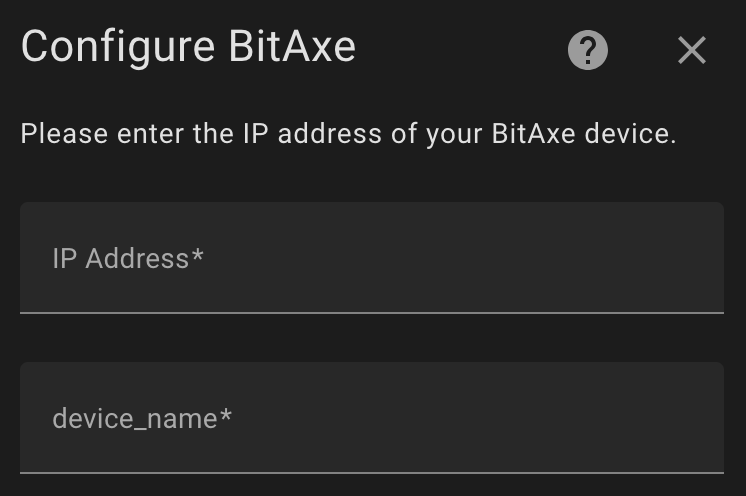
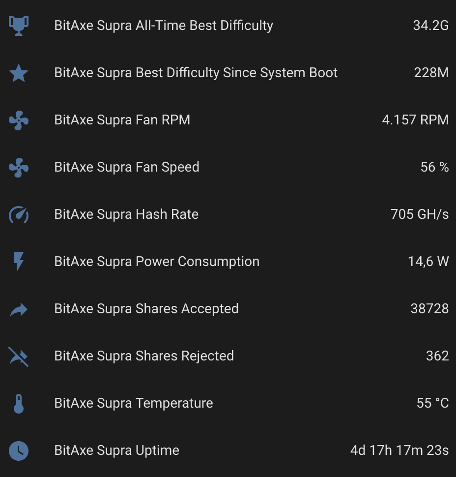

# Bitaxe Home Assistant Integration

This is a custom integration for Bitaxe miners in Home Assistant.

## Features

- **Real-time Monitoring**: Keep track of power, temperature, hashrate, and other mining metrics in real-time.
- **Easy Configuration**: Configure your Bitaxe device effortlessly through Home Assistant's user interface.

## Installation

1. Navigate to your Home Assistant configuration directory. This is usually the `/config` directory in your Home Assistant setup.

2. Clone the repository directly into the `custom_components` folder (create the folder if it doesn't exist):
   ```bash
   mkdir -p custom_components
   git clone https://github.com/DerMiika/Bitaxe-HA-Integration.git custom_components/bitaxe
   ```

3.  Restart Home Assistant.

## Configuration

To set up the integration, follow these steps:

1. Go to Settings > Devices & Services > Add Integration.
2. Search for "Bitaxe" and select it.
3. Enter the IP address of your Bitaxe miner.
4.  Choose a name for your Bitaxe miner (this can be any name you prefer).
5.  Complete the setup.

## Screenshots

### Setup Screen


### Sensor Data Screen


